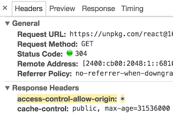

# Ссылки CDN

*UMD-сборки React и ReactDOM доступны через CDN.*

```javascript
<script crossorigin src="https://unpkg.com/react@16/umd/react.development.js"></script>
<script crossorigin src="https://unpkg.com/react-dom@16/umd/react-dom.development.js"></script>
```

Вышеупомянутые версии предназначены только для разработки и не подходят для production. Минимизированные и оптимизированные производственные версии React доступны по адресу:

```javascript
<script crossorigin src="https://unpkg.com/react@16/umd/react.production.min.js"></script>
<script crossorigin src="https://unpkg.com/react-dom@16/umd/react-dom.production.min.js"></script>
```

Чтобы загрузить определенную версию `react` и `react-dom`, замените `16` номер версии.

## Для чего атрибут crossorigin?

Если вы используете React из CDN, мы рекомендуем сохранить [crossorigin] атрибут:

```javascript
<script crossorigin src="..."></script>
```

Мы также рекомендуем проверить, что используемый CDN задает `Access-Control-Allow-Origin`: *HTTP-заголовок:



Это позволяет улучшить [обработку ошибок] в React 16 и более поздних версиях.